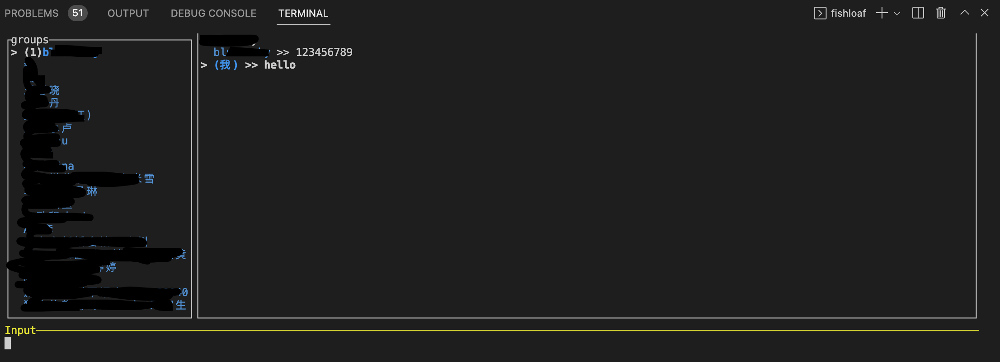

# fishloaf
## brief introduction
旨在提供轻松鱼悦的上班体验，支持以命令行的方式使用微信聊天，可通过任意命令行启动，比如IDEA或vscode的命令行，将聊天窗口融入到工作界面中

fishloaf项目为TUI界面(terminal ui)，需配合 [fishloafServer](https://github.com/hawklithm/fishloafServer)项目一起使用
可在任意命令行环境中执行，比如在IDEA或者vscode的命令行中执行

交互界面基于tui库构建

效果图如下：


## 基础使用方式
* 左侧栏为用户和群列表，可通过上下键移动光标，回车键表示选中；
* 右侧栏为聊天窗，会根据选中的用户进行切换
* 左右键可控制在用户列表和聊天窗之间切换
* 底部为编辑框，初始为非编辑模式，按e键进入编辑模式，进入编辑模式后可进行文字输入，敲回车之后会把输入内容发送给当前选中的用户或群，发送后清空输入框，在编辑模式下按ESC键退出编辑模式
* 在非编辑模式下按q键退出程序，由于会话和登陆是通过fishloafServer来保持的，只要fishloafServer还在线，再退出TUI后重新打开fishloaf即可快速开始使用，有效防止窥屏事件的发生


## installation
### from source code
#### 环境
    java8+
    rustc 1.65.0+
    maven 3.8.6+

 
1. 启动fishloafServer
```shell
git clone https://github.com/hawklithm/fishloafServer.git
cd fishloafServer
mvn clean package
java -jar target/fishloafServer-1.0-SNAPSHOT.jar
```
微信扫描二维码，即可完成登陆

2. 在任意命令行环境中启动TUI界面
```shell
git clone https://github.com/hawklithm/fishloaf.git
cd fishloaf
cargo run
```

### from binary
1. 从[fishloafServer release 页面](https://github.com/hawklithm/fishloafServer/releases)下载已编译好的fishloafServer包
2. 根据使用的平台从[fishloaf](https://github.com/hawklithm/fishloaf/releases)下载已编译好的fishloaf包
3. 启动fishloafServer 
```
java -jar fishloafServer-*.jar
```
微信扫描二维码并登陆

4. 解压fishloaf_*.zip
```shell
unzip fishloaf_*.zip
```

5. 启动fishloaf
```
./fishloaf
```
